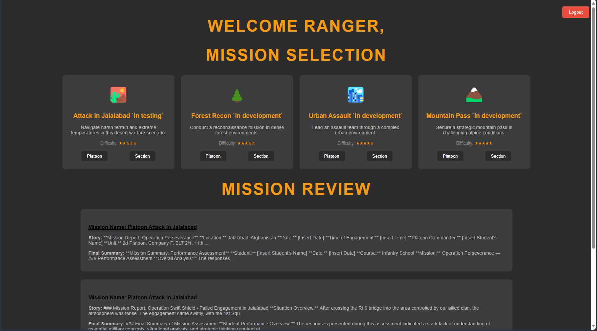

# TEWTSIM: Tactical Exercise Without Troops Simulator

## Project Overview

TEWTSIM is a web-based application developed to support Canadian Armed Forces training initiatives, with a focus on providing a platform for tactical decision-making at the Infantry School in a low-stakes environment. This tool digitizes Tactical Decision Games (TDGs), offering an interactive platform for CAF personnel to sharpen their critical thinking skills in simulated combat scenarios.

🎖️ **Developed under the guidance of WO Outar, Platoon Warrant of OPP, Infantry School**

🚀 **Current Status:** Prototype

🔐 **Classification:** UNCLASSIFIED

### Try It Out!
Visit [tewtsim.ca](https://tewtsim.ca) and log in with:
- Codename: "Ranger"
- Password: "Red"

To see some examples of completed missions!

Feel free to create your own account!

(Note: OAuth2 implementation is planned for enhanced security upon wider adoption.)

  
  
  

## Key Features

### 🏁 Mission Start
- Choose your challenge:
  - 🔵 Platoon-level operations
  - 🟢 Section-level tactics
- Review your mission history

### 📋 Mission Brief
- Comprehensive mission briefing
- Interactive tools for note-taking and combat estimate preparation

### ❓ Tactical Decision Point
- Time-constrained situational questions
- FRAG-O creation exercise

### 🏆 Mission Debrief
- AI-generated outcome based on your decisions
- Constructive feedback on performance
- Final assessment and mission summary

## Technical Stack

- **Backend:** PHP, MariaDB for dynamic mission management
- **Frontend:** HTML, CSS, JavaScript, ensuring responsive design
- **Asset Management:** Efficient handling via symbolic links
- **Scenario Customization:** Flexible mission parameters through stored HTML content

## Future Enhancements

- 🚀 Upgrade to modern frameworks (React, Bootstrap, Node.js) **(In development!)**
- ☁️ Potential migration to serverless SQL service for improved efficiency
- 📚 Expand TDG library in collaboration with CAF SMEs 
- 🤖 Integrate Protected B AI models for scenario generation
- 🧠 Implement advanced reasoning capabilities

## Training Benefits

TEWTSIM aims to enhance:
1. Critical thinking in tactical scenarios
2. Decision-making under pressure
3. Strategic approach exploration
4. Preparation for field exercises
5. Tactical textual scenario data collection for organizational analysis and future development

## Installation Guide (Windows Environment)

1. Install XAMPP
   - Select Apache2, PHP, and MySQL/MariaDB components during installation

2. Clone the TEWTSIM repository
   - Execute in command prompt: `git clone https://github.com/M-o-liver/TEWTSIM`
   - Clone into the 'htdocs' folder of your XAMPP installation

3. Configure XAMPP
   - Launch XAMPP control panel
   - Start Apache and MySQL services

4. Set up the database
   - Access phpMyAdmin via the MySQL 'Admin' button in XAMPP
   - Create a new database named "mission_app"
   - Import the SQL file: `C:/xampp/htdocs/TEWTSIM-main/sql/mission_app.sql`
   - Ensure Foreign Key checks are enabled during import

5. Configure Apache
   - Open Apache's `httpd.conf` file
   - Locate the `DocumentRoot` directive
   - Set it to: `DocumentRoot "C:/xampp/htdocs/TEWTSIM-main"`
   - Save the file

6. Set up API key
   - Create a new file: `/xampp/htdocs/TEWTSIM-main/keys/openaikey.txt`
   - Insert your OpenAI API key into this file

7. Restart Apache
   - In the XAMPP control panel, stop and restart the Apache service

8. Access the application
   - Open a web browser and navigate to `http://localhost`

Note: For deployment on Linux systems, database configuration may require adjustments. Consult your system administrator or IT support for assistance with Linux deployment.

## Scenario Management

TEWTSIM scenarios are managed through the `missions` table in the database. To add a new scenario:

1. Develop the Tactical Decision Game (TDG)
   - Create a detailed situation description
   - Define the mission parameters
   - Compile any additional relevant details
   - Select an appropriate map for the scenario
   - Develop a comprehensive answer key

2. Prepare the scenario content
   - Utilize AI assistance to convert the scenario into HTML format
   - Ensure all content is properly formatted and structured

3. Add the new scenario to the database
   - Insert a new row into the `missions` table with the following information:
     - Assign a unique mission ID
     - Provide a descriptive mission name
     - Insert the HTML-formatted situation, mission, and additional details
     - Include the map reference (e.g., `/maps/scenario_map.png`)
     - Specify the answer key file name (e.g., `answerkey_X.txt`, where X is the mission ID)

4. Upload associated files
   - Place the map image in the appropriate directory
   - Add the answer key file to the designated folder

5. Test the new scenario
   - Access the new scenario via `mission.php?id=X` (replace X with the assigned mission ID)
   - Verify all content displays correctly
   - Ensure the mission flow functions as intended

Best Practices:
- Maintain consistency in HTML structure across scenarios
- Follow the established format for situations and answer keys (refer to `answers/desertplatoon.txt` and `answers/answerkey_1.txt` for examples)
- Regularly backup the database and associated files
- Consider version control for scenario content to track changes over time

For assistance with scenario development or technical implementation, please consult me at oliver.cross@forces.gc.ca 

## Contribution Guidelines

We welcome contributions that enhance TEWTSIM's training value. However, remember:

1. Maintain OPSEC at all times
2. Follow CAF standards
3. Submit pull requests for review before merging

For assistance with scenario development or technical implementation, please contact oliver.cross@forces.gc.ca

## Acknowledgments

This project is being developed to support the training initiatives of the Canadian Armed Forces, with particular focus on the needs of the Infantry School. Special thanks to Warrant Outar, Platoon Warrant of OPP at the Infantry School, for providing invaluable guidance and expertise throughout the development process.

## Disclaimer

TEWTSIM is a training tool and does not replace official Canadian Armed Forces doctrine or training programs. All users must adhere to proper security protocols and handling of military information.

---

Developed with pride in support of the Canadian Armed Forces. 

🍁